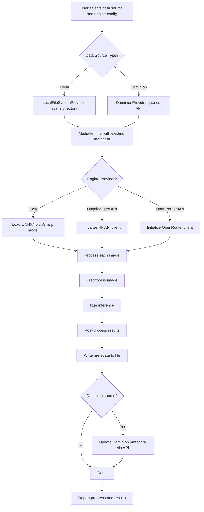

# Synapic.NET ↔ Python Alignment Plan

## Executive Summary

The .NET port (`synapic.net`) has a solid Clean Architecture foundation but contains significant **placeholder implementations** in the AI inference layer and is missing several features present in the Python version. This plan identifies all gaps and proposes a prioritized approach to bring the .NET version to feature parity.

---

## Current State Assessment

### What the .NET Version Does Well
- Clean Architecture with proper layer separation (Core → Infrastructure → Application → UI)
- Well-defined interfaces ([`IDataSourceProvider`](synapic.net/src/Synapic.Core/Interfaces/IDataSourceProvider.cs), [`IModelInferenceEngine`](synapic.net/src/Synapic.Core/Interfaces/IModelInferenceEngine.cs), [`IImageMetadataService`](synapic.net/src/Synapic.Core/Interfaces/IImageMetadataService.cs))
- Daminion DAMS integration with authentication, search, and metadata update
- Local file system provider with filtering
- IPTC/EXIF metadata read/write with retry logic
- Session persistence via JSON
- Both WPF and WinForms UI frontends
- DI container setup via [`ServiceCollectionExtensions`](synapic.net/src/Synapic.Application/Configuration/ServiceCollectionExtensions.cs)

### Critical Gaps vs Python Version

| Area | Python | .NET | Gap Severity |
|------|--------|------|-------------|
| Model inference | Real HuggingFace transformers pipeline | Placeholder TorchSharp with dummy models | **Critical** |
| HuggingFace API | Fully implemented | Enum exists, no implementation | **Critical** |
| OpenRouter API | Fully implemented | Enum exists, no implementation | **Critical** |
| Model download/cache | Auto-downloads from HuggingFace Hub | No download capability | **High** |
| Image preprocessing | ImageNet normalization, proper transforms | Basic resize + normalize to 0-1 only | **High** |
| Post-processing | Softmax, label mapping, top-k | Returns hardcoded strings | **Critical** |
| System prompt | Configurable for API engines | Field exists but unused | **Medium** |
| Log output panel | Real-time log display | No log panel in WPF UI | **Medium** |
| Results grid | Full results display | Missing from WPF MainWindow.xaml | **Medium** |
| Progress/Status bar | Visible in UI | Missing from WPF MainWindow.xaml | **Medium** |
| Filter UI controls | Untagged filters, scope selection | Not exposed in either UI | **Medium** |
| Configuration | File-based config | Windows Registry only | **Medium** |
| Error handling | Comprehensive with user feedback | Basic try/catch | **Low** |
| Unit tests | Some coverage | No test project | **Low** |

---

## Architecture Issues Found

### 1. Core Layer Has External Dependency
[`IImageMetadataService`](synapic.net/src/Synapic.Core/Interfaces/IImageMetadataService.cs:33) returns `SixLabors.ImageSharp.Image`, which means [`Synapic.Core.csproj`](synapic.net/src/Synapic.Core/Synapic.Core.csproj:10) depends on `SixLabors.ImageSharp`. The Core/Domain layer should have **zero external dependencies**.

**Fix:** Move `LoadImageAsync` out of `IImageMetadataService` or return a byte array/stream instead.

### 2. DI Registers Multiple IDataSourceProvider Implementations
In [`ServiceCollectionExtensions.cs`](synapic.net/src/Synapic.Application/Configuration/ServiceCollectionExtensions.cs:59-60), both `LocalFileSystemProvider` and `DaminionProvider` are registered as `IDataSourceProvider`. When resolved, only the last registration wins. Need a factory or keyed services pattern.

### 3. WPF UI Missing Key Elements
[`MainWindow.xaml`](synapic.net/src/Synapic.UI/MainWindow.xaml) is missing:
- Progress bar
- Status text display
- Results DataGrid
- Log output panel

The bottom `StackPanel` only has buttons but no output area.

---

## Detailed Implementation Plan

### Phase 1: Fix Architecture Issues

#### 1.1 Remove ImageSharp from Core Layer
- Create a new interface method signature that returns `byte[]` or `Stream` instead of `Image`
- Move `LoadImageAsync` to a separate `IImageLoader` interface in Infrastructure
- Remove `SixLabors.ImageSharp` PackageReference from `Synapic.Core.csproj`

#### 1.2 Fix Data Source Provider Resolution
- Implement a `DataSourceProviderFactory` that selects the correct provider based on `DataSourceType`
- Or use .NET 8+ keyed services: `services.AddKeyedTransient<IDataSourceProvider, LocalFileSystemProvider>("Local")`
- Update [`ProcessingManager`](synapic.net/src/Synapic.Application/Services/ProcessingManager.cs) to use the factory

### Phase 2: Implement Real AI Inference (Critical)

#### 2.1 Replace Placeholder TorchSharp Engine
The current [`TorchSharpInferenceEngine`](synapic.net/src/Synapic.Infrastructure/AI/TorchSharpInferenceEngine.cs:96-118) creates dummy sequential models. Replace with:

- **Option A - ONNX Runtime:** Use `Microsoft.ML.OnnxRuntime` to load real ONNX models exported from HuggingFace. This is the most practical .NET approach.
- **Option B - TorchSharp with SafeTensors:** Load actual model weights from `.safetensors` files. Requires implementing each architecture in TorchSharp.

**Recommendation:** Option A (ONNX Runtime) for classification/detection, keep TorchSharp for custom models.

#### 2.2 Implement Proper Image Preprocessing
Replace the basic preprocessing in [`PreprocessImageAsync`](synapic.net/src/Synapic.Infrastructure/AI/TorchSharpInferenceEngine.cs:182-215):
- Add ImageNet mean/std normalization: mean=[0.485, 0.456, 0.406], std=[0.229, 0.224, 0.225]
- Support different input sizes per model
- Add center crop option

#### 2.3 Implement Real Post-Processing
Replace the hardcoded results in [`PostProcessResultsAsync`](synapic.net/src/Synapic.Infrastructure/AI/TorchSharpInferenceEngine.cs:218-236):
- Load ImageNet labels (1000 classes) or model-specific labels
- Apply softmax for classification
- Return top-k predictions with confidence scores
- For image-to-text: implement beam search decoding or use model-specific decoder

#### 2.4 Add Model Download and Caching
Implement in [`LocalModelRepository`](synapic.net/src/Synapic.Infrastructure/AI/LocalModelRepository.cs):
- Download models from HuggingFace Hub via HTTP
- Cache in local `models/` directory
- Support `config.json` parsing for model metadata
- Progress reporting during download

### Phase 3: Implement API-Based Engines

#### 3.1 HuggingFace Inference API Engine
Create `HuggingFaceInferenceEngine : IModelInferenceEngine`:
- POST to `https://api-inference.huggingface.co/models/{model_id}`
- Send image as base64 or binary
- Parse JSON response based on task type
- Handle rate limiting and model loading states

#### 3.2 OpenRouter API Engine
Create `OpenRouterInferenceEngine : IModelInferenceEngine`:
- POST to `https://openrouter.ai/api/v1/chat/completions`
- Send image as base64 in multimodal message format
- Use system prompt from [`EngineConfig.SystemPrompt`](synapic.net/src/Synapic.Core/Entities/ProcessingSession.cs:63)
- Parse structured response for categories/keywords/description

### Phase 4: Complete the UI

#### 4.1 WPF MainWindow Completion
Add to [`MainWindow.xaml`](synapic.net/src/Synapic.UI/MainWindow.xaml):
- `ProgressBar` bound to `CurrentProgress`
- `TextBlock` bound to `StatusMessage`
- `DataGrid` bound to `Results` collection
- `TextBox` or `ListBox` for log output (multiline, scrolling)
- Untagged filter checkboxes
- Daminion scope selection controls
- System prompt TextBox for API engines
- API key TextBox for HuggingFace/OpenRouter

#### 4.2 WinForms UI Parity
Ensure [`MainForm.cs`](synapic.net/src/Synapic.WinForms/MainForm.cs) has matching controls for all new features.

#### 4.3 Consolidate ViewModel Logic
[`MainViewModel`](synapic.net/src/Synapic.UI/ViewModels/MainViewModel.cs) and [`MainFormViewModel`](synapic.net/src/Synapic.WinForms/ViewModels/MainFormViewModel.cs) share ~80% identical code. Extract shared logic into a base class or shared service in the Application layer.

### Phase 5: Configuration and Robustness

#### 5.1 Replace Registry with File-Based Config
- Use `appsettings.json` or a dedicated config file in AppData
- Support both user-level and app-level settings
- Migrate from Windows Registry in [`MainViewModel.LoadSettings`](synapic.net/src/Synapic.UI/ViewModels/MainViewModel.cs:431-449)

#### 5.2 Add Resilience Patterns
- Add Polly for HTTP retry/circuit breaker on API calls
- Add timeout handling for model inference
- Add graceful degradation when GPU is unavailable
- Improve cancellation token propagation throughout the pipeline

#### 5.3 Add Unit Test Project
- Create `Synapic.Tests` project
- Test `ProcessingManager` workflow with mocked dependencies
- Test `ImageMetadataService` read/write
- Test `LocalFileSystemProvider` filtering logic
- Test data source provider factory

---

## Dependency Changes Required

```xml
<!-- New packages for Synapic.Infrastructure -->
<PackageReference Include="Microsoft.ML.OnnxRuntime" Version="1.17.x" />
<PackageReference Include="Microsoft.Extensions.Http.Polly" Version="10.0.x" />

<!-- New packages for Synapic.Application -->
<PackageReference Include="Microsoft.Extensions.Configuration.Json" Version="10.0.x" />
```

---

## Workflow Diagram



---

## Priority Order for Implementation

1. **Fix Core layer dependency** - architectural correctness
2. **Fix DI provider resolution** - runtime correctness
3. **Implement ONNX Runtime inference** - core functionality
4. **Add proper preprocessing/postprocessing** - core functionality
5. **Complete WPF UI** - usability
6. **Add HuggingFace API engine** - feature parity
7. **Add OpenRouter API engine** - feature parity
8. **Add model download system** - usability
9. **Replace registry config** - portability
10. **Add resilience patterns** - robustness
11. **Consolidate ViewModels** - maintainability
12. **Add unit tests** - quality
